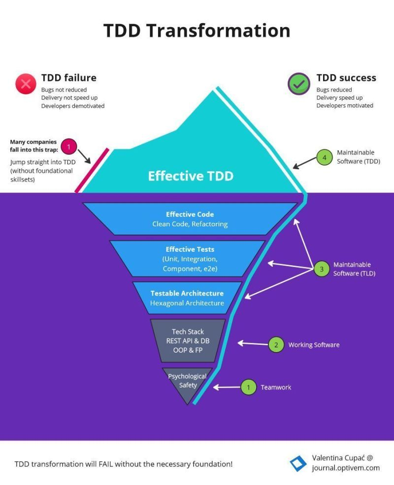

# "TDD does NOT work!" - said the team 

Once upon a time, a team was working on a legacy project. The code was 
messy - it was a big ball of mud. There were some automated tests, but no one 
really trusted them - instead, manual regression testing was the only thing 
they could rely on. As the product grew, as more developers joined, this 
became an even BIGGER problem. 

The team was WASTING a lot of time solving bugs, and there was not much time 
for features - they spent 80% of the sprint solving some bugs (both new bugs 
and regression bugs) and maybe 20% on features. The Product Owner started 
complaining why delivery is so slow and why there are so many bugs. 

A manager heard that TDD is the solution to the problems above. 

So the manager sent the whole team (and mandated all the other teams too) to 
go on a 2-5 day TDD Training. So the teams went on the TDD Training, they 
watched the trainer apply TDD on a simple demo project. It all looked great 
on the demo project. 

But then on the real project, it was challenging - the real project was much 
more complex than the demo project AND the real project was a legacy app and 
not a greenfield project like illustrated during training. 

So the team concluded: "TDD does not work!" 

So how can we actually introduce TDD successfully? We have to solve 
foundational problems first: 

- Testable Architecture- Effective Tests- Effective Code 

They are the foundational skillsets that are prerequisites for TDD. In legacy 
applications, they could be practiced within the TEST LAST approach. 

Only after the team has effective skillsets in those foundational practices, 
then we could say they can practice effective TDD. In TDD, we use those same 
skillsets but just with a different sequence (tests before code) and 
incrementally (test then code - RED-GREEN-REFACTOR, rather than batch of code 
then batch of tests).

## Chat GPT

TDD, or Test-Driven Development, is an approach to software development that 
emphasizes writing tests before writing the actual code. The process 
typically involves writing a failing test, writing the minimum amount of code 
to make the test pass, and then refactoring the code to improve its design 
while keeping all tests passing. 

In the given text, the team encountered difficulties when trying to apply TDD 
to a legacy project. They found that the real project was more complex than 
the demo project used in the training, and the existing codebase was messy 
and hard to work with. As a result, they concluded that TDD does not work. 

To introduce TDD successfully, it is important to address foundational 
problems first. The text suggests three foundational skill sets that need to 
be in place before effective TDD can be practiced: testable architecture, 
effective tests, and effective code. 

1. Testable Architecture: Legacy applications often have tightly coupled and 
poorly structured code, making it difficult to write tests. To introduce TDD, 
the team needs to work on refactoring the architecture to make it more 
modular, decoupled, and testable. This may involve breaking dependencies, 
extracting interfaces, and applying design patterns to improve the codebase. 

2. Effective Tests: The team should focus on writing meaningful and reliable 
tests. Tests should cover different scenarios, edge cases, and potential 
failure points. Test cases should be clear, concise, and provide good 
coverage of the codebase. Writing effective tests requires an understanding 
of the system's behavior and potential issues. 

3. Effective Code: Writing clean, maintainable, and modular code is crucial 
for successful TDD. The team needs to practice good coding practices, such as 
following SOLID principles, writing small and focused methods/functions, and 
using appropriate naming conventions. Writing effective code helps in writing 
corresponding tests and simplifies the refactoring process. 

The text suggests that these foundational skill sets can be practiced within 
the "TEST LAST" approach in legacy applications. In this approach, the team 
focuses on improving testability, writing effective tests, and refactoring 
the codebase, even without strictly following TDD. Once the team has gained 
proficiency in these foundational practices, they can transition to 
practicing effective TDD by applying the same skill sets but with a different 
sequence (tests before code) and an incremental approach (red-green-refactor). 

In summary, to introduce TDD successfully, it is important to address 
foundational problems related to testable architecture, effective tests, and 
effective code. By mastering these foundational skill sets, the team can 
gradually adopt TDD practices and benefit from its advantages, such as faster 
feedback, improved code quality, and better test coverage.