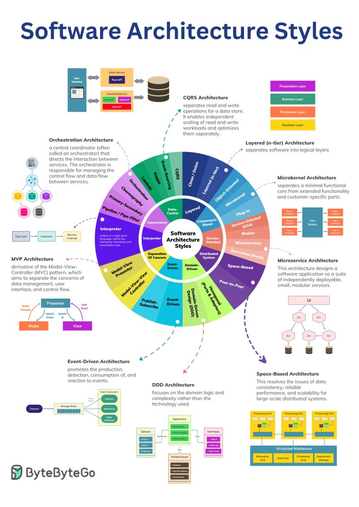

# Python - Software Architecture

This Python repository encompasses various essential concepts such as Domain-
Driven Design (DDD), design patterns, and Clean Architecture, providing a 
comprehensive resource for developers seeking to enhance their software 
development skills. It emphasizes best practices and promotes modular, 
maintainable, and scalable code by incorporating industry-standard 
architectural principles. By exploring this repository, developers can gain 
insights into how to create robust and well-structured applications using a 
combination of DDD, design patterns, and Clean Architecture.

Software architecture refers to the high-level design and structure of a 
software system. It involves making fundamental decisions about the 
organization and arrangement of components, modules, and subsystems within 
the system to ensure its functionality, reliability, scalability, and 
maintainability. 

Key Concepts in Software Architecture: 

1. Components: These are self-contained modules or building blocks of a 
software system that encapsulate a set of related functions or services. 
Components can be libraries, modules, or even microservices. 

2. Modules: Modules represent logical units of the system that perform 
specific tasks or functions. They can be designed to be independent and 
reusable, facilitating modular development and easier maintenance. 

3. Layers: Layers are a way to organize components or modules based on their 
functionality or abstraction level. Each layer represents a specific level of 
abstraction, such as presentation, business logic, or data storage. The 
layered architecture promotes separation of concerns and modularity. 

4. Patterns: Software architecture often relies on design patterns, which are 
proven solutions to recurring design problems. Examples of common patterns 
include the Model-View-Controller (MVC) pattern, the publish-subscribe 
pattern, and the layered architecture pattern. 

5. Interfaces: Interfaces define the contracts and interactions between 
different components or modules. They establish a clear boundary and 
communication mechanism between different parts of the system, promoting 
loose coupling and encapsulation. 

6. Scalability: Software architecture considers scalability to ensure that a 
system can handle increased workloads or user demands. Scalability can be 
achieved through techniques like load balancing, horizontal or vertical 
scaling, and the use of distributed systems. 

7. Reliability: Architecture plays a crucial role in ensuring system 
reliability. It involves designing fault-tolerant and resilient components, 
implementing error handling mechanisms, and incorporating redundancy and 
backup strategies. 

8. Security: Software architecture needs to address security concerns by 
incorporating security measures and best practices. This includes 
authentication, authorization, data encryption, secure communication 
protocols, and protection against common vulnerabilities. 

9. Performance: The architecture of a software system affects its 
performance. Design decisions related to data access, caching, concurrency, 
and resource management impact the system's efficiency and responsiveness. 

10. Maintainability: An architecture that is easy to understand, modify, and 
maintain is crucial for long-term success. Modularity, separation of 
concerns, documentation, and adherence to coding standards contribute to 
maintainability. 

It's important to note that software architecture is not limited to a single 
architectural style or approach. Different systems require different 
architectural choices based on their specific requirements, such as web 
applications, mobile apps, distributed systems, or enterprise-level software. 
Architects need to consider trade-offs and make informed decisions to create 
a robust and effective architecture for a given software system. 
